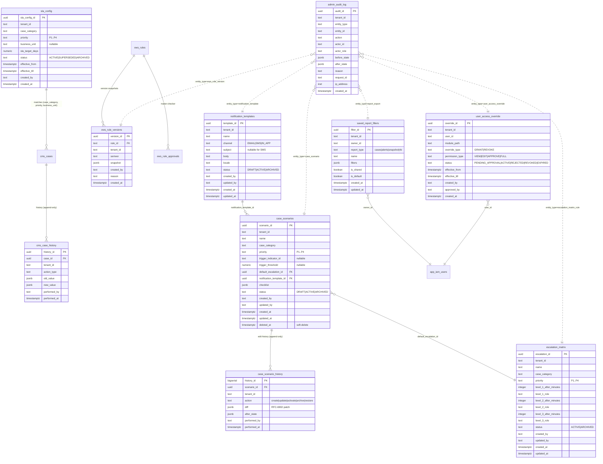

# ZorEWS — Consolidated DB Schema (10 tables for the new feature surface)

**Last updated:** 2026-05-09
**Database:** PostgreSQL 16 (local: `apex-ews-pg` on `:55432`; production: Aurora PG 16)
**ORM:** None — services use the `pg` client directly with raw SQL. TypeScript type defs live alongside the per-feature stores (e.g. `services/bff/src/admin/*_types.ts`). This is intentional — adding an ORM is out of scope for the prototype.

This doc covers the 10 tables that back the new feature surface (case tracking, EWS rule diff viewer, SLA, scenarios, escalation, notifications, saved filters, user overrides, admin audit). For the broader catalogue (raw / staging / mart / audit / app_iam / app_alerts / app_bff) see [database-schema.md](database-schema.md).

## Table inventory

| # | Table | Schema | Source migration | Status | Backs feature |
|---|---|---|---|---|---|
| 1 | `sla_config` | `app_admin` | [018_sla_config.sql](../data/schema/018_sla_config.sql) | shipped | T6 M14.12 SLA targets per category/priority/BU |
| 2 | `cms_case_history` | `app_cases` | [013_cms_cases.sql](../data/schema/013_cms_cases.sql) | shipped | BAC §3.1.5 case tracking timeline (`case_tracking_log`) |
| 3 | `ews_rule_versions` | `app` | [015_ews_rules_versions.sql](../data/schema/015_ews_rules_versions.sql) | shipped | EWS Rules-Plus diff viewer |
| 4 | `case_scenarios` | `app_admin` | [021_case_scenarios_and_admin_extensions.sql](../data/schema/021_case_scenarios_and_admin_extensions.sql) | **new (M14.15)** | Admin-defined case templates |
| 5 | `case_scenario_history` | `app_admin` | 021 (above) | **new (M14.15)** | Append-only edit log w/ JSON diff |
| 6 | `user_access_override` | `app_admin` | [016_user_access_override.sql](../data/schema/016_user_access_override.sql) | shipped | Per-user maker-checker access overrides |
| 7 | `admin_audit_log` | `app_admin` | [016_user_access_override.sql](../data/schema/016_user_access_override.sql) (extended in 020 + 021) | shipped + extended | Generic admin audit (referenced by 3, 5, 6, 8, 9, 10) |
| 8 | `saved_report_filters` | `app_admin` | [020_saved_report_filters.sql](../data/schema/020_saved_report_filters.sql) | shipped | Per-user Reports filter presets |
| 9 | `notification_templates` | `app_admin` | 021 (above) | **new (M14.15)** | Email/SMS templates managed by admin |
| 10 | `escalation_matrix` | `app_admin` | 021 (above) | **new (M14.15)** | Time-window → role escalation rules |

## ERD



## Cross-cutting conventions

All 10 tables follow the same conventions, established by the prototype's earlier schema work:

- **Surrogate keys.** UUID v4 (via `gen_random_uuid()`) for entity-style tables; `BIGSERIAL` for append-only event tables (`case_scenario_history`).
- **Tenant scoping.** Every table carries `tenant_id TEXT NOT NULL`. Composite uniques and FKs always include `tenant_id` so cross-tenant access is structurally impossible.
- **Timestamps.** `created_at TIMESTAMPTZ NOT NULL DEFAULT now()`. `updated_at` only on tables that actually mutate; an `app_admin.set_updated_at()` trigger keeps it in sync.
- **Actor trail.** `created_by TEXT NOT NULL`, `updated_by TEXT` (nullable until first edit). `admin_audit_log` carries the full `actor_id / actor_role / request_id / ip_address / user_agent` block.
- **Soft-delete.** Only on entity tables that need a "trash" UX (`case_scenarios`, `notification_templates`). Status-based archival (`status = 'ARCHIVED'`) is preferred where the row participates in audit.
- **Append-only.** `admin_audit_log`, `cms_case_history`, `case_scenario_history`. Migration 021 installs `RAISE EXCEPTION` triggers on UPDATE/DELETE for `case_scenario_history` (matches existing pattern on `audit.event_log`).
- **Enums via CHECK.** Postgres ENUM types are avoided — they require a separate migration to evolve. CHECK constraints on TEXT columns are looser but easier to widen forward (see `admin_audit_log_entity_check` extended by 020 + 021).
- **FK ON DELETE.** `RESTRICT` for cross-feature references (so a referenced `escalation_matrix` row can't be silently deleted while `case_scenarios` reference it). `CASCADE` only for owned children inside the same aggregate (`cms_case_history → cms_cases`, `case_scenario_history → case_scenarios`).
- **Indexes.** `tenant_id` is always the first column of any composite index. Status-filtered partial indexes for the hot listing path (`WHERE status = 'ACTIVE'` etc.).
- **Money + time.** `NUMERIC(18,2)` for currency amounts (none in the new tables). `TIMESTAMPTZ` everywhere; `INTERVAL` is avoided because pg-driver round-trip is messy.

## Per-table column list (NEW tables — 4)

### 4. `app_admin.case_scenarios`

Admin-curated case templates. When an alert lands and matches the trigger criteria (indicator + threshold), the case-creation pipeline reads the matching scenario to seed the new case with priority, default escalation, and notification template.

| Column | Type | Constraints | Notes |
|---|---|---|---|
| `scenario_id` | UUID | PK, default `gen_random_uuid()` | |
| `tenant_id` | TEXT | NOT NULL | Tenant scope |
| `name` | TEXT | NOT NULL, len 1..120, **UNIQUE per tenant** | Display name |
| `case_category` | TEXT | NOT NULL | Matches `sla_config.case_category` (free text — no FK; SLA is the canonical source) |
| `priority` | TEXT | NOT NULL, CHECK in `('P1','P2','P3','P4')` | |
| `trigger_indicator_id` | TEXT | nullable | e.g. `FIN-002` — when set, scenario auto-applies on indicator fire |
| `trigger_threshold` | NUMERIC(10,4) | nullable | Threshold value for the trigger indicator |
| `default_escalation_id` | UUID | FK → `escalation_matrix(escalation_id)` ON DELETE RESTRICT | Default escalation rule |
| `notification_template_id` | UUID | FK → `notification_templates(template_id)` ON DELETE RESTRICT, nullable | Optional template for the on-create notification |
| `checklist` | JSONB | NOT NULL DEFAULT `'[]'` | Array of `{title, required: bool}` items shown on the case detail page |
| `status` | TEXT | NOT NULL DEFAULT `'DRAFT'`, CHECK in `('DRAFT','ACTIVE','ARCHIVED')` | |
| `created_by` | TEXT | NOT NULL | |
| `updated_by` | TEXT | nullable | |
| `created_at` | TIMESTAMPTZ | NOT NULL DEFAULT `now()` | |
| `updated_at` | TIMESTAMPTZ | NOT NULL DEFAULT `now()` | Trigger-maintained |
| `deleted_at` | TIMESTAMPTZ | nullable | Soft-delete |

**Indexes:**
- UNIQUE `(tenant_id, lower(name)) WHERE deleted_at IS NULL`
- `(tenant_id, status, updated_at DESC)` for the listing page
- `(tenant_id, trigger_indicator_id) WHERE status = 'ACTIVE'` for the hot trigger-match path

### 5. `app_admin.case_scenario_history`

Append-only edit log for `case_scenarios`. One row per mutation.

| Column | Type | Constraints | Notes |
|---|---|---|---|
| `history_id` | BIGSERIAL | PK | |
| `scenario_id` | UUID | NOT NULL, FK → `case_scenarios(scenario_id)` ON DELETE CASCADE | |
| `tenant_id` | TEXT | NOT NULL | Denormalised for tenant-isolated retention queries |
| `action` | TEXT | NOT NULL, CHECK in `('create','update','activate','archive','restore')` | |
| `diff` | JSONB | NOT NULL | RFC-6902 JSON Patch from before → after |
| `after_state` | JSONB | NOT NULL | Full row snapshot for replay (pure-data; no FK joins required) |
| `performed_by` | TEXT | NOT NULL | |
| `performed_at` | TIMESTAMPTZ | NOT NULL DEFAULT `now()` | |

**Indexes:**
- `(tenant_id, scenario_id, performed_at DESC)`
- `(tenant_id, performed_at DESC)` for compliance dump

**Append-only enforcement:** `BEFORE UPDATE OR DELETE` trigger raises `EXCEPTION` (matches `audit.event_log` pattern).

### 9. `app_admin.notification_templates`

Email/SMS/in-app templates that scenarios + escalations reference.

| Column | Type | Constraints | Notes |
|---|---|---|---|
| `template_id` | UUID | PK, default `gen_random_uuid()` | |
| `tenant_id` | TEXT | NOT NULL | |
| `name` | TEXT | NOT NULL, len 1..120, **UNIQUE per tenant + locale** | |
| `channel` | TEXT | NOT NULL, CHECK in `('EMAIL','SMS','IN_APP')` | |
| `subject` | TEXT | nullable; **MUST be NULL for SMS, NON-NULL for EMAIL/IN_APP** (CHECK) | |
| `body` | TEXT | NOT NULL, len 1..10000 | Mustache placeholders allowed: `{{customer_name}}` etc. |
| `locale` | TEXT | NOT NULL DEFAULT `'en-IN'` | BCP-47 |
| `status` | TEXT | NOT NULL DEFAULT `'DRAFT'`, CHECK in `('DRAFT','ACTIVE','ARCHIVED')` | |
| `created_by` | TEXT | NOT NULL | |
| `updated_by` | TEXT | nullable | |
| `created_at` | TIMESTAMPTZ | NOT NULL DEFAULT `now()` | |
| `updated_at` | TIMESTAMPTZ | NOT NULL DEFAULT `now()` | Trigger-maintained |
| `deleted_at` | TIMESTAMPTZ | nullable | Soft-delete |

**Indexes:**
- UNIQUE `(tenant_id, lower(name), locale) WHERE deleted_at IS NULL`
- `(tenant_id, channel, status, updated_at DESC)` for listing

### 10. `app_admin.escalation_matrix`

Per-(case_category, priority) escalation rules referenced by `case_scenarios`. Up to 3 escalation levels with role + minutes-since-creation.

| Column | Type | Constraints | Notes |
|---|---|---|---|
| `escalation_id` | UUID | PK, default `gen_random_uuid()` | |
| `tenant_id` | TEXT | NOT NULL | |
| `name` | TEXT | NOT NULL, len 1..120, **UNIQUE per tenant** | |
| `case_category` | TEXT | NOT NULL | Pairs with `sla_config.case_category` |
| `priority` | TEXT | NOT NULL, CHECK in `('P1','P2','P3','P4')` | |
| `level_1_after_minutes` | INTEGER | NOT NULL, CHECK ≥ 0 | |
| `level_1_role` | TEXT | NOT NULL | RBAC role (matches `infra/rbac/matrix.json`) |
| `level_2_after_minutes` | INTEGER | nullable, CHECK > `level_1_after_minutes` when set | |
| `level_2_role` | TEXT | nullable; **NOT NULL iff level_2_after_minutes set** (CHECK) | |
| `level_3_after_minutes` | INTEGER | nullable, CHECK > `level_2_after_minutes` when set | |
| `level_3_role` | TEXT | nullable; **NOT NULL iff level_3_after_minutes set** (CHECK) | |
| `status` | TEXT | NOT NULL DEFAULT `'ACTIVE'`, CHECK in `('ACTIVE','ARCHIVED')` | |
| `created_by` | TEXT | NOT NULL | |
| `updated_by` | TEXT | nullable | |
| `created_at` | TIMESTAMPTZ | NOT NULL DEFAULT `now()` | |
| `updated_at` | TIMESTAMPTZ | NOT NULL DEFAULT `now()` | Trigger-maintained |

**Indexes:**
- UNIQUE `(tenant_id, lower(name))`
- `(tenant_id, case_category, priority, status)` for the on-create lookup

## Per-table column list (EXISTING tables — 6, summary)

Existing tables already documented in their migration files; abbreviated here. Click the source link in the inventory above for the full DDL.

- **`sla_config`** — see [018_sla_config.sql](../data/schema/018_sla_config.sql). PK `sla_config_id` UUID. Composite key `(tenant_id, case_category, priority, COALESCE(business_unit, ''))` UNIQUE WHERE status='ACTIVE'. Edits are SUPERSEDE not UPDATE.
- **`cms_case_history`** (the `case_tracking_log`) — see [013_cms_cases.sql](../data/schema/013_cms_cases.sql) lines 148-169. PK `history_id` UUID, FK `case_id → cms_cases ON DELETE CASCADE`. Action types: `create / update / transition / assign / unassign / escalate / close / reopen / note_added / attachment_added / attachment_deleted`. The BFF resolver in [services/bff/src/cms/case_tracking.ts](../services/bff/src/cms/case_tracking.ts) wraps this with type discrimination + payload context for the timeline UI.
- **`ews_rule_versions`** — see [015_ews_rules_versions.sql](../data/schema/015_ews_rules_versions.sql). UNIQUE `(tenant_id, rule_id, semver)`. Companion `ews_rule_approvals` table enforces 4-eyes at the DB layer (`approver_username <> maker_username` CHECK).
- **`user_access_override`** — see [016_user_access_override.sql](../data/schema/016_user_access_override.sql). Maker-checker enforced: `created_by <> approved_by` CHECK. Status moves forward only — never deletes. UNIQUE active row per (tenant, user, module, permission).
- **`admin_audit_log`** — see [016_user_access_override.sql](../data/schema/016_user_access_override.sql) lines 110-137. Multi-source: `entity_type` CHECK is widened forward by each new feature. Migration 021 widens it to also accept `case_scenario / notification_template / escalation_matrix_rule / ews_rule_version`. **Append-only.**
- **`saved_report_filters`** — see [020_saved_report_filters.sql](../data/schema/020_saved_report_filters.sql). One default per (owner, report_type) via partial UNIQUE.

## Migration files

| File | Purpose |
|---|---|
| [data/schema/021_case_scenarios_and_admin_extensions.sql](../data/schema/021_case_scenarios_and_admin_extensions.sql) | Forward — creates the 4 new tables, widens `admin_audit_log_entity_check`, installs append-only triggers on `case_scenario_history`, seeds default templates + escalation rules. Idempotent. |
| [data/schema/021_case_scenarios_and_admin_extensions_rollback.sql](../data/schema/021_case_scenarios_and_admin_extensions_rollback.sql) | Rollback — drops the 4 new tables in reverse FK order, restores prior `admin_audit_log_entity_check`. |
| [data/schema/seed_021_admin_defaults.sql](../data/schema/seed_021_admin_defaults.sql) | Re-runnable seed — extra templates / escalation rules per tenant. |
| [data/schema/verify_021.sql](../data/schema/verify_021.sql) | Verification queries — row counts + structure checks. |

## Verification (post-migration)

```sql
-- 1. New tables exist + are empty (or seeded)
\dt app_admin.case_scenarios
\dt app_admin.case_scenario_history
\dt app_admin.notification_templates
\dt app_admin.escalation_matrix

-- 2. Append-only trigger blocks UPDATE on case_scenario_history
BEGIN;
INSERT INTO app_admin.case_scenario_history
  (scenario_id, tenant_id, action, diff, after_state, performed_by)
VALUES
  (gen_random_uuid(), 'BIL', 'create', '[]'::jsonb, '{}'::jsonb, 'system:test');
UPDATE app_admin.case_scenario_history SET action = 'update' WHERE history_id = (SELECT max(history_id) FROM app_admin.case_scenario_history);
-- expect: ERROR — trigger raised
ROLLBACK;

-- 3. admin_audit_log accepts the new entity_types
SELECT pg_get_constraintdef(oid)
FROM pg_constraint
WHERE conname = 'admin_audit_log_entity_check';
-- expect: CHECK (entity_type IN ('user_access_override','report_export','ews_rule_version','case_scenario','notification_template','escalation_matrix_rule'))

-- 4. Seeded defaults present
SELECT tenant_id, channel, count(*)
FROM app_admin.notification_templates GROUP BY 1, 2 ORDER BY 1, 2;
SELECT tenant_id, case_category, priority, count(*)
FROM app_admin.escalation_matrix GROUP BY 1, 2, 3 ORDER BY 1, 2, 3;
```
