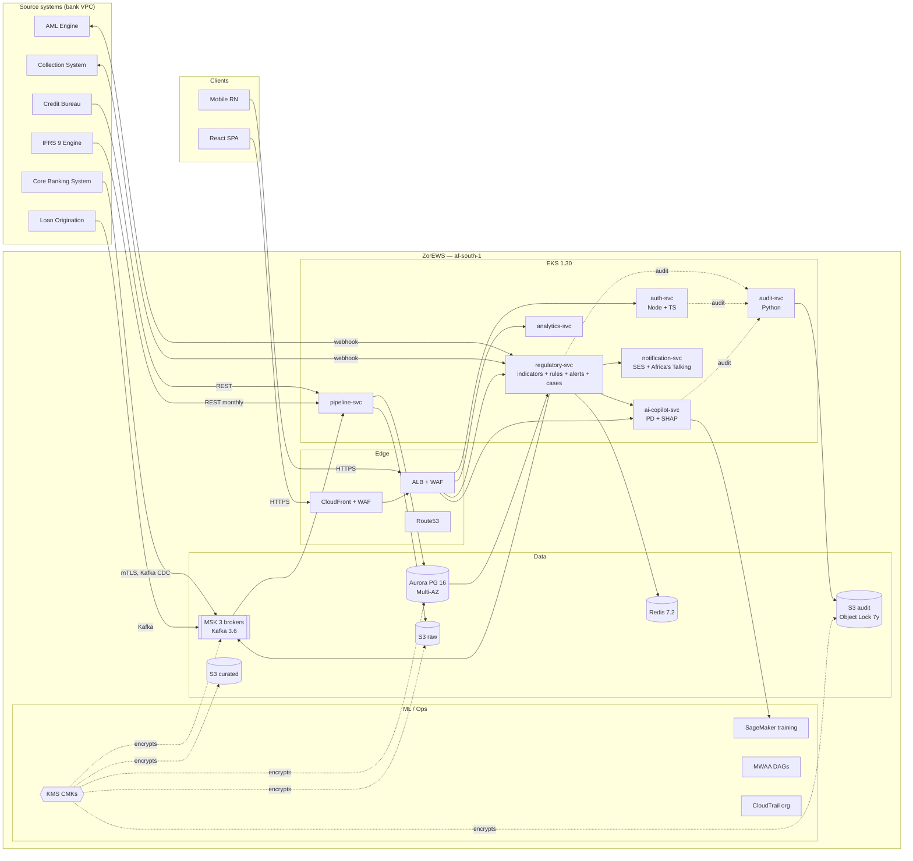

# ZorEWS — Target Architecture

> Phase 0 deliverable T0.4. Reference architecture for the prototype monorepo. The diagram below tracks the IaC + service skeleton this agent has shipped.

## Logical view

## Network view

- **Region:** `af-south-1` (Cape Town). DR-passive in `eu-west-1` (Phase 5 / T5.2).
- **VPC:** `10.0.0.0/16`, three AZs.
  - **Public** subnets — ALB, NAT EIPs.
  - **Private** subnets — EKS workers, all microservice pods.
  - **Data** subnets — Aurora, ElastiCache, MSK; isolated route table.
- **Egress:** 1 NAT/AZ for non-AWS traffic; S3 + ECR + STS reach via VPC endpoints.
- **Ingress:** CloudFront (SPA) + ALB (API). WAF Common ruleset + 2000 req/5min IP rate limit. Optional Shield Advanced.

## Security view

- **Identity:** Cognito-or-equivalent SSO (out of scope here) → JWT minted by `auth-svc` after username + password + TOTP. Tokens RS256, signed by KMS asymmetric key `alias/apex-ews-secret`.
- **M2M identity (T4.24):** partner / mobile / LOS callers obtain access tokens via `POST /oauth/token` (RFC 6749 §4.4 client_credentials). Principals live in `app_iam.service_clients`; the issued token carries `tenant_id` + `client_id` + `typ: "m2m"` and is verified by the BFF. Same RS256 signer as user sessions.
- **Multi-tenant gate (T4.24):** every public `/v1/*` call must carry `X-Tenant-ID` + `X-Channel`. The BFF tenant middleware validates the tenant exists in `app_iam.tenants` and that the channel is in its `channels_allowed` whitelist; rejects with the `{header, error: {code, message, severity}}` envelope per Banking API doc §11. Phase 1 reference endpoint: `POST /v1/ews/evaluate` — Phase 2 will roll out to the rest of `/v1/*`.
- **Service identity:** IRSA per microservice — no static keys (NFR-SEC-1).
- **At-rest:** SSE-KMS on every S3 bucket, Aurora, MSK, EBS. Five separate CMKs (aurora / s3 / msk / secret / ebs).
- **In-transit:** TLS 1.2+ everywhere. mTLS for bank-side webhooks via PrivateLink.
- **Audit:** every state-changing call publishes `apex.audit.events` → `audit-svc` hash-chain → S3 Object Lock 7y (NFR-AUDIT).
- **Region pinning:** SCP denies non-allowed regions for the Workloads OU.
- **OWASP ASVS L2** controls live in service code (NFR-SEC-2).

## Data flow — alert end-to-end

1. CBS event arrives on `apex.cbs.events` (Kafka).
2. `pipeline-svc` writes to Aurora `raw.cbs_events` and triggers downstream dbt models (`mart.customer_360`, `mart.loan_360`, `mart.txn_features`).
3. `regulatory-svc/indicators` recomputes the indicators touched by the event and publishes to `apex.indicator.values`.
4. `regulatory-svc/rules` evaluates live rules against the new values, possibly `regulatory-svc/alerts` raises an alert on `apex.regulatory.events`.
5. `ai-copilot-svc` enriches the alert with PD + SHAP.
6. `regulatory-svc/cases` consumes the alert, opens a case, routes high-severity to Collection.
7. `notification-svc` fans out (in-app, SES, Africa's Talking SMS).
8. `audit-svc` records every state change.

Target P95 alert latency event → UI: < 60s (NFR-PERF-1).

## DR view (Phase 5 preview)

- Aurora Global DB to `eu-west-1` (RPO < 1s).
- S3 cross-region replication for audit + curated.
- MSK MirrorMaker 2 to a passive cluster.
- Route53 health-check failover at the ALB.
- Targets: RTO ≤ 30 min, RPO < 1s (NFR-DR).

## Operationalization layer — UPDATED: 2026-05-21

The platform now ships with a complete production-deployment surface alongside the application architecture documented above. This layer is intentionally separate from app design — the contracts above are stable; what follows is the runtime path.

### Real-time alert path (closed code-side 2026-05-21)

- **Producer:** `services/regulatory-svc/indicators/src/kafka_producer.ts` (T2.12.2) publishes to `apex.indicator.values`; partition key = customer_id; dev outbox + production Kafka impls + DLQ fallback.
- **BFF latency telemetry:** `services/bff/src/streaming_alert_path.ts` (T2.12.1) measures p95 against the EWS.docx §3.5 60s budget; per-tenant in-memory ledger; `/v1/streaming/{indicator-events,latency,events}` routes.
- **Consumer:** `services/regulatory-svc/rules/src/kafka_consumer.ts` (T2.12 downstream) — `IndicatorValueConsumer` interface + `OutboxIndicatorValueConsumer` (dev) + `KafkaIndicatorValueConsumer` (production, kafkajs wrapper) + `validateIndicatorValueEvent` + `makeIndicatorValueConsumer(env)` factory.
- **DLQ:** `services/regulatory-svc/indicators/src/streaming_dlq.ts` — NDJSON crash-safe day-partitioned sink.
- **Deployment:** `infra/k8s/streaming-consumer.yaml` (Deployment + ServiceAccount + PDB minAvailable=1, ESO-sourced `KAFKA_BROKERS`).
- **IRSA:** `apex-ews-${env}-streaming-consumer` role in `infra/terraform/20-eks/cert_manager_irsa.tf` with topic-scoped MSK IAM-auth read + consumer-group `apex-ews-streaming-rule-evaluator*`.
- **External dependency:** running MSK cluster (resolved by `terraform apply` 30-data + ArgoCD sync).

### Mobile offline-sync (closed code-side 2026-05-21)

- `mobile/src/sync/offline_queue.ts` — `OfflineSyncQueue` interface + `InMemoryOfflineQueue` (dev/tests) + `AsyncStorageOfflineQueue` (production via `AsyncStorageLike` abstraction) + `SyncRunner` with exponential back-off (`baseDelayMs × 2^retry_count` default 1s base, 6 max retries) + `PermanentSyncError` + `buildIdempotencyKey` 64-char deterministic helper.
- 6 `QueuedActionKinds`: `alert.ack`, `alert.unack`, `case.log_action`, `investigation.note`, `investigation.step_complete`, `field_visit.log`.
- 29 jest tests; external dependency = Expo + `@react-native-async-storage/async-storage` install (one-line import swap in bootstrap).

### Production HTTP integrations (closed code-side 2026-05-21)

- `services/bff/src/integrations/cbs_http_client.ts` — `HttpCbsClient` implementing the `CbsClient` interface declared by `services/bff/src/integrations/cbs_production.ts`. Maps 4 OpenAPI operations to bank CBS REST paths declared in `integrations/cbs/openapi.yaml`. Bearer auth resolved lazily per request (Secrets Manager rotation friendly), 8s timeout via AbortController, 202 → `pending=true`, network errors → status=599 sentinel, unknown operations → `ok:false + 400`.
- `ResilientCbsClient` (T3.1.1, `cbs_production.ts`) wraps any concrete `CbsClient` with retry + circuit breaker + audit-trail fan-out.
- `services/bff/src/integrations/ifrs9_http_adapter.ts` — `HttpIfrs9Adapter` implementing the M14.2 `Ifrs9Adapter` interface. Defensive normalisation: PD/LGD/EAD clamped to safe bounds; `pd_lifetime ≥ pd_12m` IFRS9 invariant auto-enforced; ECL re-computed as `driver_PD × LGD × EAD` (Stage 1 driver = pd_12m; Stages 2/3 = pd_lifetime); `dpd_days ≥ 0` clamped.
- External dependency: bank-side endpoint URLs + Bearer tokens in AWS Secrets Manager (`apex-ews/prod/integrations/{cbs,ifrs9}/{base-url,bearer-token}`).

### Continuous-learning pipeline (closed code-side 2026-05-21)

- `data/airflow/dags/feature_store_backfill.py` (T2.1, Year-2 Theme E) — 6-step DAG (`wait_for_marts` ExternalTaskSensor → `dbt run --select feat_values_backfill` → `dbt test` → retention purge via `aurora_writer` hook (`DELETE … WHERE observed_at < NOW() - INTERVAL '24 months'`) → S3 offline-store sync via `export_feature_store_to_s3` macro to `apex-ews-prod-curated/feature_store/dt={ds}/` → `publish_audit feature_store.backfilled`). Schedule 06:30 IST daily, depends on `feature_build.publish`.
- `data/airflow/dags/retraining_scheduler.py` (T5.1, Year-2 Theme E) — every-6h DAG polls `/v1/ai/retraining/schedules` per tenant, fires `python -m ml.pipelines.train_pd`, POSTs final outcome with metrics, auto-promotes when AUC ≥ 0.78. `MAX_RETRAINS_PER_RUN=3` caps cost; idempotent.
- External dependency: MWAA cluster running + `RETRAINING_TOKEN_SECRET` in Secrets Manager.

### Observability + GitOps

- **Prometheus rules:** `infra/k8s/prometheus/{recording-rules,alerting-rules,infra-alerting}.yaml` + `servicemonitors.yaml`. Recording rules for tenant burn-rate; two-window alerts (1h fast / 6h slow / 3d slow).
- **4 Grafana dashboards** under `infra/k8s/grafana/dashboards/`: `slo-overview`, `bff-service`, `aurora-msk-eks`, `tenant-spend`.
- **ArgoCD App-of-Apps** at `infra/k8s/argocd/bootstrap.yaml` + 14 child Applications (10 services + observability + ESO + platform-base) with sync waves 0-8.
- **External Secrets Operator** with KMS-scoped IRSA condition (`kms:ViaService = secretsmanager.<region>.amazonaws.com`) + 7 ExternalSecret manifests.
- **Karpenter NodePools** with disruption budgets at `infra/k8s/karpenter/`.
- **cert-manager** via Let's Encrypt DNS01 at `infra/k8s/cert-manager/` + IRSA role.

See `EXECUTION-PLAYBOOK.md` for the 13-step sequential go-live runbook.
