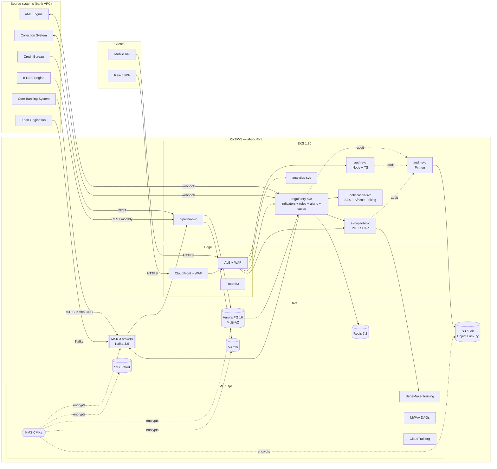

# ZorEWS — Target Architecture

> Phase 0 deliverable T0.4. Reference architecture for the prototype monorepo. The diagram below tracks the IaC + service skeleton this agent has shipped.

## Logical view

## Network view

- **Region:** `af-south-1` (Cape Town). DR-passive in `eu-west-1` (Phase 5 / T5.2).
- **VPC:** `10.0.0.0/16`, three AZs.
  - **Public** subnets — ALB, NAT EIPs.
  - **Private** subnets — EKS workers, all microservice pods.
  - **Data** subnets — Aurora, ElastiCache, MSK; isolated route table.
- **Egress:** 1 NAT/AZ for non-AWS traffic; S3 + ECR + STS reach via VPC endpoints.
- **Ingress:** CloudFront (SPA) + ALB (API). WAF Common ruleset + 2000 req/5min IP rate limit. Optional Shield Advanced.

## Security view

- **Identity:** Cognito-or-equivalent SSO (out of scope here) → JWT minted by `auth-svc` after username + password + TOTP. Tokens RS256, signed by KMS asymmetric key `alias/apex-ews-secret`.
- **M2M identity (T4.24):** partner / mobile / LOS callers obtain access tokens via `POST /oauth/token` (RFC 6749 §4.4 client_credentials). Principals live in `app_iam.service_clients`; the issued token carries `tenant_id` + `client_id` + `typ: "m2m"` and is verified by the BFF. Same RS256 signer as user sessions.
- **Multi-tenant gate (T4.24):** every public `/v1/*` call must carry `X-Tenant-ID` + `X-Channel`. The BFF tenant middleware validates the tenant exists in `app_iam.tenants` and that the channel is in its `channels_allowed` whitelist; rejects with the `{header, error: {code, message, severity}}` envelope per Banking API doc §11. Phase 1 reference endpoint: `POST /v1/ews/evaluate` — Phase 2 will roll out to the rest of `/v1/*`.
- **Service identity:** IRSA per microservice — no static keys (NFR-SEC-1).
- **At-rest:** SSE-KMS on every S3 bucket, Aurora, MSK, EBS. Five separate CMKs (aurora / s3 / msk / secret / ebs).
- **In-transit:** TLS 1.2+ everywhere. mTLS for bank-side webhooks via PrivateLink.
- **Audit:** every state-changing call publishes `apex.audit.events` → `audit-svc` hash-chain → S3 Object Lock 7y (NFR-AUDIT).
- **Region pinning:** SCP denies non-allowed regions for the Workloads OU.
- **OWASP ASVS L2** controls live in service code (NFR-SEC-2).

## Data flow — alert end-to-end

1. CBS event arrives on `apex.cbs.events` (Kafka).
2. `pipeline-svc` writes to Aurora `raw.cbs_events` and triggers downstream dbt models (`mart.customer_360`, `mart.loan_360`, `mart.txn_features`).
3. `regulatory-svc/indicators` recomputes the indicators touched by the event and publishes to `apex.indicator.values`.
4. `regulatory-svc/rules` evaluates live rules against the new values, possibly `regulatory-svc/alerts` raises an alert on `apex.regulatory.events`.
5. `ai-copilot-svc` enriches the alert with PD + SHAP.
6. `regulatory-svc/cases` consumes the alert, opens a case, routes high-severity to Collection.
7. `notification-svc` fans out (in-app, SES, Africa's Talking SMS).
8. `audit-svc` records every state change.

Target P95 alert latency event → UI: < 60s (NFR-PERF-1).

## DR view (Phase 5 preview)

- Aurora Global DB to `eu-west-1` (RPO < 1s).
- S3 cross-region replication for audit + curated.
- MSK MirrorMaker 2 to a passive cluster.
- Route53 health-check failover at the ALB.
- Targets: RTO ≤ 30 min, RPO < 1s (NFR-DR).
